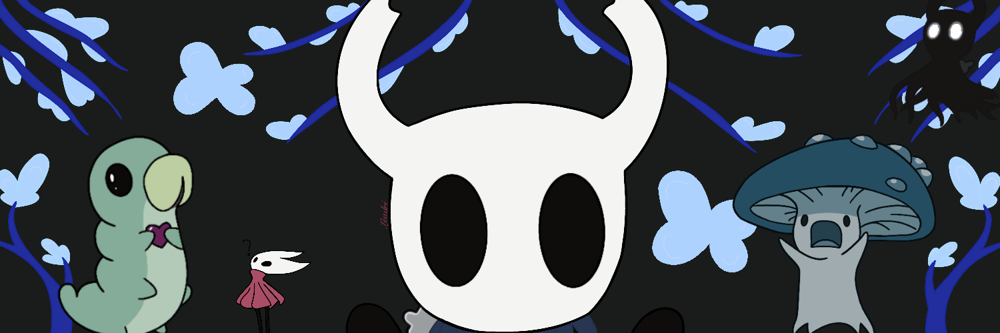

 

<!-- <h1 align="center">
 
</h1> -->
<h3 align="center">Boardgame enthusiast, hopelessly terrible video game player and a growing developer from Poland </h3>

  

<!-- 
  
 -->

<!--
- 🔭 I’m currently working on ["League-of-Electron" - League of Leagends fanmade client](https://github.com/ReformedMrozu/League-of-Electron)

- 🌱 I’m currently learning **RHEL, NGRX**

- 👯 I’m looking to collaborate on **Web projects**

- 🤝 I’m looking for help with **Docker**
-->
- 👨‍💻 All of my projects are available at [https://github.com/rgaw-pon?tab=repositories](https://github.com/rgaw-pon?tab=repositories)

- 💬 Ask me about **anything 😊**

- 📫 How to reach me **@rgaw-pon**

<!--   GitHub stats graph -->
### 📈 GitHub Activity Graph:

 | .                                                                                                                                                 | .                                                                                       |
 | ------------------------------------------------------------------------------------------------------------------------------------------------- | --------------------------------------------------------------------------------------- |
 |  | </img> |

<h3 align="left">Connect with me:</h3>

